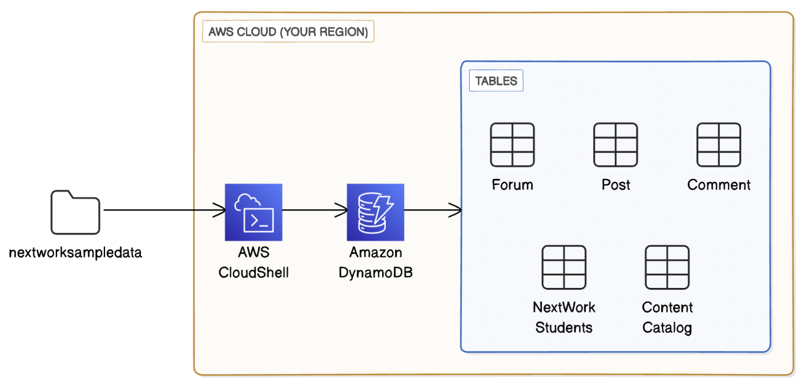
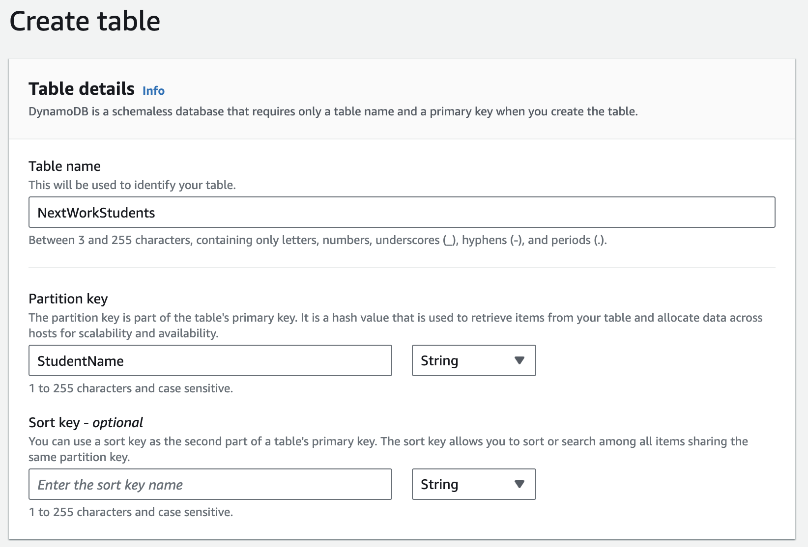
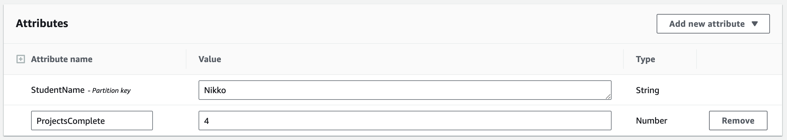

# Loading and Querying Data in DynamoDB

## Description
In this short project, I explored DynamoDB by creating tables, loading and editing data, and running queries using both the management console and AWS CloudShell. The procedures are divided into two parts - Part 1: Loading Data and Part 2: Querying Data.

## Tools and Services Used
- Amazon DynamoDB
- AWS CLI
- AWS CloudShell

## Cost and Time
- Cost: $0
- Time: 1 hour

## Key Procedures
**_Part 1: Load Data_**
1. Create a DynamoDB table
2. Create a DynamoDB table using AWS CloudShell
3. Load data into tables

**_Part 2: Query Data_**
1. Run a query in the console
2. Run a query with AWS CloudShell
3. Set up a transaction

## Step-by-Step WalkthrIough
### _Part 1: Load Data_
### Step 1: Create Table (Console)

I started off by creating a simple DynamoDB table using the management console. On the "Create Table" screen, I provided a table name and set a partition key to help DynamoDB efficiently distribute and locate the data. I also disabled auto scaling for both read and write capacities to avoid any unexpected charges during this project. 

After creating the table, I selected "Explore Table Items" and created a new item to examine how to enter data manually via the console. I added an example name to the **StudentName** (partition key), then added a new attribute called **ProjectsComplete** with a value representing the number of projects completed. 

### Step 2: Create Table (CLI)

XXX

### Step 3: Load Data

XXX

### _Part 2: Query Data_
### Step 1: Run Query (Console)

XXX

### Step 2: Run Query (CLI)

XXX

### Step 3: Set Up Transaction

XXX

## Conclusion

XXX
