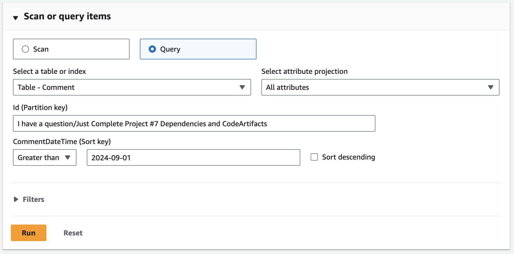

# Loading and Querying Data in DynamoDB

## Description
In this short project, I explored DynamoDB by creating tables, loading and editing data, and running queries using both the management console and AWS CloudShell. The procedures are divided into two parts - Part 1: Loading Data and Part 2: Querying Data. (_Guided project by NextWork_)

## Tools and Services Used
- Amazon DynamoDB
- AWS CLI
- AWS CloudShell

## Cost and Time
- Cost: $0
- Time: 1 hour

## Key Procedures
**_Part 1: Load Data_**
1. Create a DynamoDB table
2. Create a DynamoDB table using AWS CloudShell
3. Load data into tables

**_Part 2: Query Data_**
1. Run a query in the console
2. Run a query with AWS CloudShell
3. Set up a transaction

## Step-by-Step Walkthrough
### _Part 1: Load Data_
### Step 1: Create Table (Console)

I started off by creating a simple DynamoDB table using the management console. On the "Create Table" screen, I provided a table name and set a partition key to help DynamoDB efficiently distribute and locate the data. I also disabled auto scaling for both read and write capacities to avoid any unexpected charges during this project. 

After creating the table, I selected "Explore Table Items" and created a new item to examine how to enter data manually via the console. I added an example name to the **StudentName** (partition key), then added a new attribute called **ProjectsComplete** with a value representing the number of projects completed. 

### Step 2: Create Table (CLI)

After getting familiar with manually creating a table through the console, I decided to make the process more efficient by using **AWS CloudShell**, since relying on the console isn't ideal for handling large amounts of data. To get started, I clicked on the CloudShell icon at the top of my screen to open the CLI environment. 

Then, I ran some basic commands (code provided by NextWork) to create tables using CLI. 

To check if the tables were created successfully, I went back to the console and hit the "Tables" tab. There, I saw the four new tables I had just set up with CloudShell. 

### Step 3: Load Data

Next, I proceeded to load some data into the tables I created. I opened up CloudShell again and ran a bit of code to download and unzip a file with the data I needed for the tables. 

To verify the contents of the file, I ran **cat Forum.json** to read one of the JSON files directly in the terminal. It showed that the file had loaded successfully and contained the information about the new items and its attributes. 

I then used the **batch-write-item** command to load the data of all four files into DynamoDB and check for any unprocessed items. 

I went back to the console to check that the new items were uploaded successfully and started looking at the differences in attributes across the items. This is when I saw the flexibility of DynamoDB as a non-relational database - each item can have its own set of attributes, which is particularly useful in the real world when handling various types of data. 

### _Part 2: Query Data_
### Step 1: Run Query (Console)

Now onto part 2, where I query the data loaded into DynamoDB. First, I used the management console to manually query some items. I navigated to the **ContentCatalog** table, entered an ID (201 in this case), and executed the query. It successfully returned only the specific item I searched for within the table. 
 

To get more familiar with the console, I proceeded to query another table. This time, I went to the **Comment** table and entered both a partition key (ID) and a sort key to query by keywords and the date the comment was posted. 

I also used the **Filters** feature when querying items, selecting an attribute and setting a condition. In this case, I filtered by a specific user's name to retrieve only the comments posted by that user. 

### Step 2: Run Query (CLI)

XXX

### Step 3: Set Up Transaction

XXX

## Conclusion

XXX
